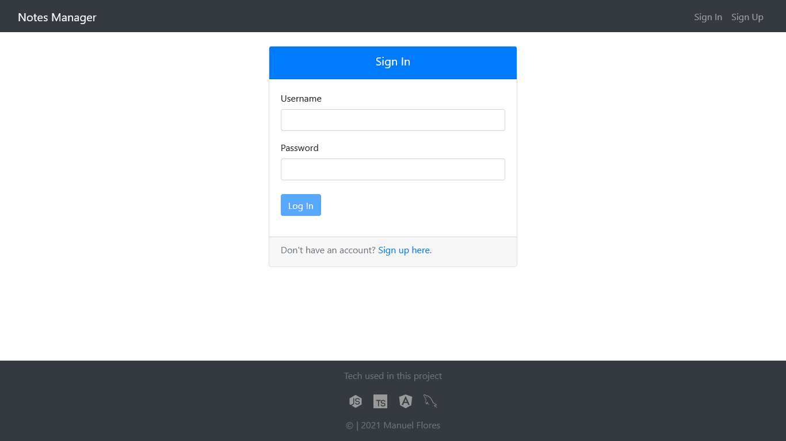
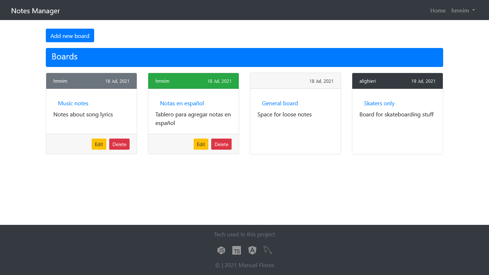
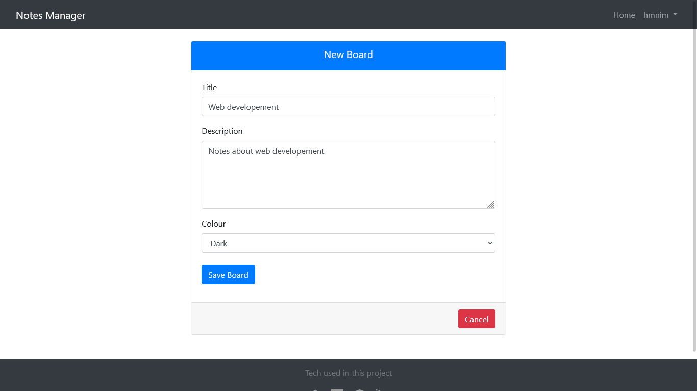
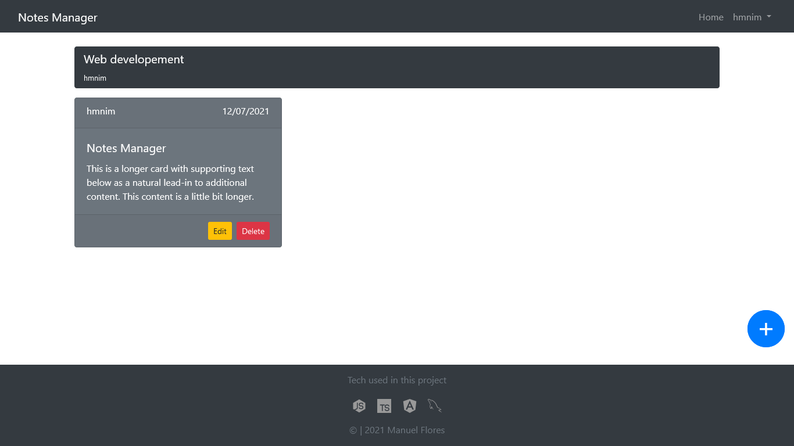
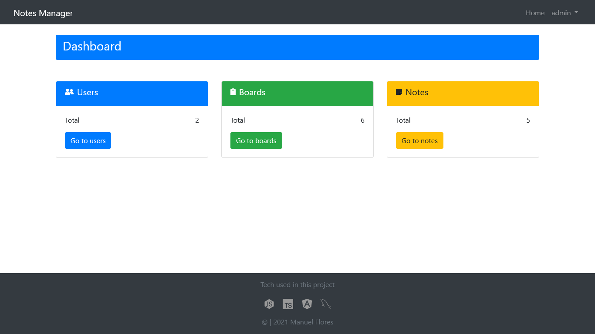
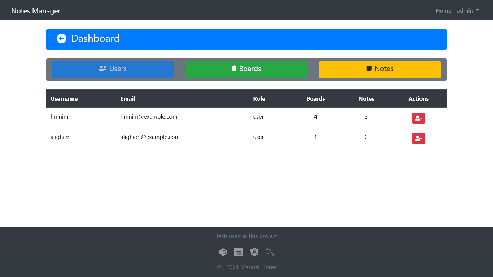

# Notes Manager

Proyecto realizado con [NodeJs](https://nodejs.org/en/), [MySQL](https://www.mysql.com/) y [Angular](https://angular.io/).

# Imágenes

> #### Vista de inicio de sesión
>
> Acceso para usuarios (normales y administrador)

> 

> #### Vista principal de la aplicación
>
> Se muestran los tableros. Solo el usuario creador puede editar el tablero; o eliminarlo si no contiene notas de otro usuario.

> 

> #### Formulario para agregar un tablero



> #### Tablero con notas agregadas
>
> Si las notas pertenecen al usuario "logueado", puede eliminar o editar las mísmas.



> #### Vista del panel de administrador
>
> El administrador puede eliminar usuarios, tableros y notas.




## Uso

Instalar módulos de la API (desde la raíz del proyecto)

```bash
cd api
npm install
```

Configurar host, puerto, usuario y contraseña en el archivo Database.ts

```bash
  api/src/config/Database.ts

  type: "mysql",
  host: "******",
  port: 3306,
  username: "******",
  password: "******",
  database: "manager_db",
  synchronize: true,
  logging: false,
  entities: ["src/entity/**/*.ts"],
```

Crear base de datos en MySQL

```bash
mysql> CREATE DATABASE manager_db;
```

---

**IMPORTANTE**

La base de datos debe crearse antes de iniciar el servidor

---

Iniciar servidor "backend"

```bash
npm run dev
```

Instalar módulos de frontend (desde la raíz del proyecto)

```bash
cd client
npm install
```

Iniciar servidor Angular

```bash
ng serve --open
```
